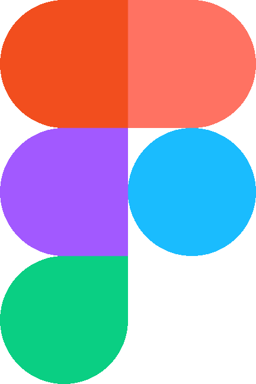

<h1 align="center">
    
</h1>

<h3 align="center">  React  React Native  Node  SQLite </h3>

--- 

This project was developed on the 11ª OmniStack Week, and is designed to connect NGOs and people interested in support theirs causes.

*Later I added cypress to realize integration tests of Register and Login, as saw on https://www.youtube.com/watch?v=gTRMuWCp8mE 

[Application Layout](https://www.figma.com/file/2C2yvw7jsCOGmaNUDftX9n/Be-The-Hero---OmniStack-11?node-id=0%3A1) on  Figma.
